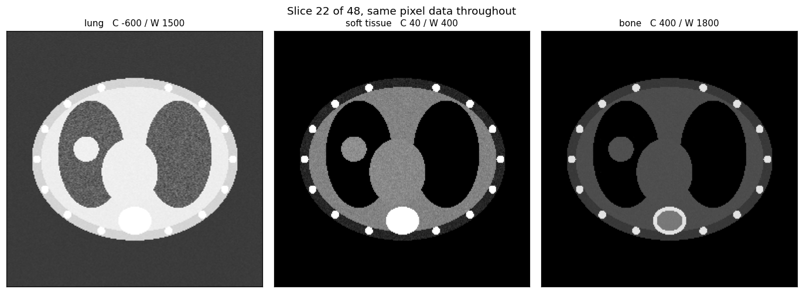

# DICOM Explorer

Load a CT or MRI series from disk, put the slices back in anatomical order, convert stored pixel values into real physical units, and view them interactively.

DICOM is the file format every clinical scanner writes and every PACS stores. Reading one file is a single line of `pydicom`. Turning a folder of several hundred files into a correctly ordered, correctly scaled 3D volume is where the actual work is, and where most first attempts go wrong. This repo handles that in about 300 readable lines.



Identical pixel data in all three panels. The nodule in the right lung is obvious in a lung window and invisible in a bone window.

## Run it

No data download required. The repo generates its own phantom series.

```bash
git clone https://github.com/YOUR-USERNAME/dicom-explorer.git
cd dicom-explorer
pip install -r requirements.txt

python make_sample_data.py          # writes 48 synthetic CT slices to data/sample_ct/
python explore.py data/sample_ct    # opens the viewer
```

In the viewer: drag the slice slider or use the arrow keys, drag centre and width to adjust the window, or click a clinical preset.

```bash
python explore.py data/sample_ct --header                        # print the DICOM header
python explore.py data/sample_ct --montage out.png --preset lung # headless render
python -m pytest tests/                                          # 7 tests
```

Point it at any real series in place of `data/sample_ct`.

## What it does

**Groups files into series.** One folder routinely holds more than one acquisition: a scout scan alongside the diagnostic series, or two reconstruction kernels of the same data. Files are grouped by `SeriesInstanceUID`, because folder structure and filenames are not reliable.

**Sorts slices by geometry, not by filename or instance number.** `ImageOrientationPatient` gives the direction cosines of the image rows and columns; their cross product is the normal to the image plane. Projecting each slice's `ImagePositionPatient` onto that normal yields a scalar that increases monotonically through the stack. This is correct for oblique and angled acquisitions, where `SliceLocation` may be absent and `InstanceNumber` may not follow anatomy.

The sample data has deliberately scrambled filenames to make this failure visible. Sorting alphabetically produces slice positions of 64, 70, 12, 50 mm; sorting geometrically produces 0, 2, 4, 6.

**Applies the modality LUT.** Scanners store unsigned integers, not physical values. The header carries the linear relationship back:

```
HU = RescaleSlope × stored_value + RescaleIntercept
```

A CT typically stores 0–4095 with an intercept of −1024, so stored value 1024 is 0 HU, which is water. Skipping this step is the most common DICOM bug: the array still looks like an image, so nothing obviously breaks, but every window preset lands on the wrong tissue and any measurement is meaningless.

**Measures slice spacing from the data.** Consecutive slice positions are differenced rather than reading `SliceThickness`, which describes how thick each slice is and says nothing about gaps or overlap between them. Uneven spacing raises a warning.

**Corrects for anisotropic pixels.** `PixelSpacing` is `(row_mm, col_mm)` and the two are not always equal. Ignoring it renders the anatomy stretched.

**Audits the header for identifying information.** `--header` lists every populated PHI field. A first pass only: private vendor tags, text burned into the pixels, and reconstructable facial anatomy in head scans all leak identity too.

## Windowing

A CT spans roughly −1000 HU (air) to +3000 HU (dense bone). A display has 256 grey levels. The full range cannot be shown at once, so a window selects an interval, clips everything outside it, and stretches what remains across the grey scale:

```
lower = centre − width/2
upper = centre + width/2
```

This is why radiologists cycle through presets on a single image rather than acquiring the scan again. `windowing.py` ships the conventional clinical starting points:

| Preset | Centre (HU) | Width (HU) |
|---|---|---|
| lung | −600 | 1500 |
| soft tissue | 40 | 400 |
| abdomen | 60 | 400 |
| liver | 60 | 160 |
| mediastinum | 50 | 350 |
| brain | 40 | 80 |
| bone | 400 | 1800 |
| angio | 300 | 600 |

MRI has no equivalent absolute scale. Signal intensity depends on the pulse sequence and the scanner, so the default window falls back to the 1st–99th percentile of the data.

## Sample data

`make_sample_data.py` builds an axial chest phantom and writes it as valid CT Image Storage instances: body wall, subcutaneous fat, lungs with vessel texture, heart, vertebral body with a cortical shell, ribs, and a 9 mm nodule spanning the middle slices.

Tissue values are the conventional Hounsfield numbers, so the clinical presets behave as they would on a real scan. Writing the files also exercises the data model from the other direction, since producing something another DICOM tool will open means getting the geometry, pixel representation, and rescale relationship right.

## Using real data

The phantom is for demonstration. For real images:

- **The Cancer Imaging Archive** hosts large public collections of de-identified CT, MR, and PET, including LIDC-IDRI (lung CT with annotated nodules).
- **`pydicom`'s bundled test files** via `pydicom.data.get_testdata_file("CT_small.dcm")`, useful for header practice.

Do not commit clinical data to a public repository. `.gitignore` excludes `*.dcm` for that reason.

## Layout

```
dicom_explorer/
  loader.py      series discovery, geometric sorting, volume assembly
  windowing.py   window/level transform and clinical presets
  metadata.py    header summary and PHI audit
  viewer.py      interactive viewer, montage and comparison export
explore.py       command line entry point
make_sample_data.py
tests/
```

## Possible extensions

- Coronal and sagittal reformats, resampling for the anisotropic voxel spacing
- Region-of-interest tool reporting mean and standard deviation HU, the basis of quantitative CT
- Segment lung parenchyma by thresholding at −400 HU and report volume in mL
- Read RTSTRUCT or SEG objects and overlay contours

## Licence

MIT
